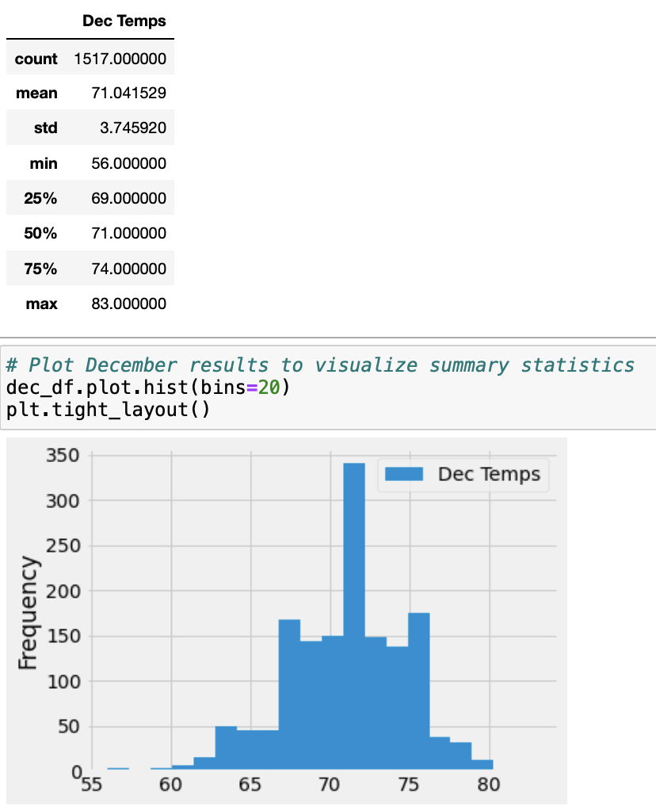

# surfs_up

## Overview
W. Avy has requested more information about temperature trends before opening the surf shop. Specifically, he wants temperature data for the months of June and December in Oahu, in order to determine if the surf and ice cream shop business is sustainable year-round. The summary of the analysis and results are described below. 

## Results 
### June
- The average recorded temperature in June is 74.95
- Minimum and maximum temperatures recorded in June were 64 and 85, respectively.

### December
- The average recorded temperature in December is 71.04
- Minimum and maximum temperatures recorded in December were 56 and 83, respectively. 

## Summary 
In order to analyze the data in more detail to gauge if the surf and ice cream shop business will be able to successfully operate year-round 2 additional queries were performed to gather precipitation data for the months of June and December. 

### June 
The average precipitation in June is approximately 0.136 with a maximum amount of 4.43. 

### December
The average precipitation in December is 0.21 with a maximum amount of 6.42. 

